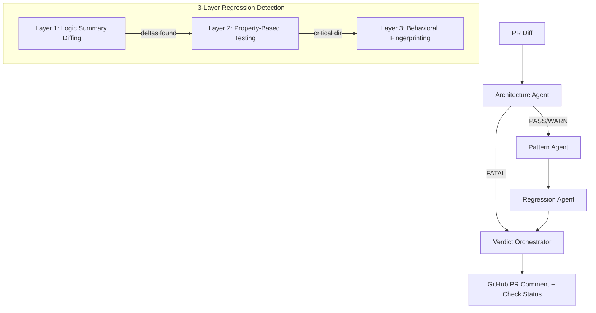

# AgentProbe

[](https://python.org)
[](https://www.langchain.com/langgraph)
[]()
[](https://opensource.org/licenses/MIT)

> Multi-agent quality governance system for AI-generated code. Runs as a GitHub Action evaluating PRs against team conventions, architectural boundaries, and semantic behavior invariants.

## Why I Built This

In April 2026, Anthropic shipped a multi-agent code review tool for Claude Code — proving the market for automated code governance is real. But most AI code reviewers (CodeRabbit, Qodo, Copilot) rely **entirely on LLMs**, which means non-deterministic results, hallucinated findings, and no way to enforce hard architectural rules.

AgentProbe takes a different approach: **deterministic rules first, optional LLM second.** The Architecture and Pattern agents use pure AST parsing — zero LLM calls, zero hallucinations. Only the Regression agent optionally uses an LLM (Ollama/local) for semantic diffing. This means you get reliable, reproducible governance that won't randomly block your team's PRs.

## Technical Highlights

- **3-layer regression detection:** Logic Summary Diffing → Property-Based Testing → Behavioral Fingerprinting — each layer is progressively more expensive, so cheap checks run first
- **Weighted scoring with short-circuit:** Architecture violations (40%) can auto-BLOCK before Pattern (25%) or Regression (35%) even run
- **AST-first, not LLM-first:** Architecture and Pattern agents use Python's `ast.parse()` for deterministic analysis — no API keys, no rate limits, no hallucinated findings
- **86 tests** covering all agents, HMAC webhook verification, and integration paths
- **LangGraph DAG orchestration** with state passing between agents and configurable YAML boundaries

## Architecture



## Agents

| Agent | Purpose | LLM? |
|-------|---------|------|
| **Architecture Agent** | Checks module boundary violations and layer rules | No |
| **Pattern Agent** | Enforces naming conventions, import order, forbidden patterns | No |
| **Regression Agent** | Detects semantic behavior changes in modified functions | Optional (Ollama) |
| **Verdict Orchestrator** | Aggregates scores and generates PR comment | No |

## Scoring

Weighted formula: `Architecture(40%) + Pattern(25%) + Regression(35%)`

| Score | Verdict |
|-------|---------|
| 0-40 | PASS |
| 41-70 | WARN |
| 71+ | BLOCK |

Architecture `FATAL` triggers an automatic `BLOCK` via short-circuit (skips Pattern + Regression).

## Quick Start

### As a GitHub Action

```yaml
# .github/workflows/agentprobe.yml
name: AgentProbe
on:
  pull_request:
    types: [opened, synchronize]

jobs:
  governance:
    runs-on: ubuntu-latest
    steps:
      - uses: checkout@v4
      - uses: your-org/agentprobe@main
        with:
          github_token: ${{ secrets.GITHUB_TOKEN }}
```

### Local Development

```bash
# Clone and install
git clone <repo-url>
cd agentprobe
python3.11 -m venv .venv
source .venv/bin/activate
pip install -e ".[dev]"

# Run tests
pytest tests/ -v

# Optional: Start Ollama for LLM-powered regression analysis
ollama pull llama3
ollama serve
```

## Configuration

### `.agentprobe/config.yaml`

```yaml
thresholds:
  block: 70
  warn: 40
weights:
  architecture: 0.40
  pattern: 0.25
  regression: 0.35
regression:
  critical_dirs: ["src/payments", "src/auth"]
  max_llm_calls_per_pr: 20
  timing_divergence_threshold: 0.20
cache:
  backend: memory
llm:
  provider: ollama
  model: llama3
  base_url: http://localhost:11434
```

### `.agentprobe/boundaries.yaml`

```yaml
modules:
  - name: payments
    path: src/payments
    allowed_imports: [src/utils, src/models]
  - name: analytics
    path: src/analytics
    allowed_imports: [src/utils]
layers:
  - name: presentation
    modules: [src/api, src/web]
  - name: domain
    modules: [src/models, src/services]
  - name: infrastructure
    modules: [src/db, src/cache]
layer_rules:
  presentation: [domain]
  domain: [infrastructure]
```

### `.agentprobe/style-profile.yaml`

```yaml
naming:
  functions: snake_case
  classes: PascalCase
  files: snake_case
imports:
  order: [builtin, external, internal, relative]
forbidden:
  - pattern: "console\\.log"
    message: "Use structured logging instead"
  - pattern: "import pdb"
    message: "Remove debugger imports"
```

## Webhook Server

For self-hosted deployments:

```bash
export GITHUB_TOKEN=ghp_...
export GITHUB_WEBHOOK_SECRET=your-secret
uvicorn src.integrations.webhook_server:app --host 0.0.0.0 --port 8000
```

Configure your GitHub webhook to point to `https://your-server/webhook` with content type `application/json` and the same secret.

## Security

- Webhook signature verification (HMAC-SHA256) is **always required**
- Function names are validated against `[a-zA-Z_][a-zA-Z0-9_]*` before subprocess execution
- Source code size limits prevent DoS (50KB per function, 1MB per diff)
- Subprocess execution uses timeouts (10s fingerprinting, 30s property tests)
- Constant-time signature comparison prevents timing attacks
- No arbitrary code execution from PR diffs without validation

## Project Structure

```
agentprobe/
  src/
    agents/           # Architecture, Pattern, Regression, Verdict
    cache/            # In-memory cache with TTL
    config/           # YAML config loader
    graph/            # LangGraph DAG (state, workflow, nodes)
    integrations/     # GitHub App, webhook server, action runner
    parsers/          # Tree-sitter engine, diff parser, import graph
    profiles/         # Boundary loader, style generator
  tests/              # 86 tests covering all agents and integrations
  action/             # GitHub Action manifest and Dockerfile
  .agentprobe/        # Default configuration files
```

## License

MIT
