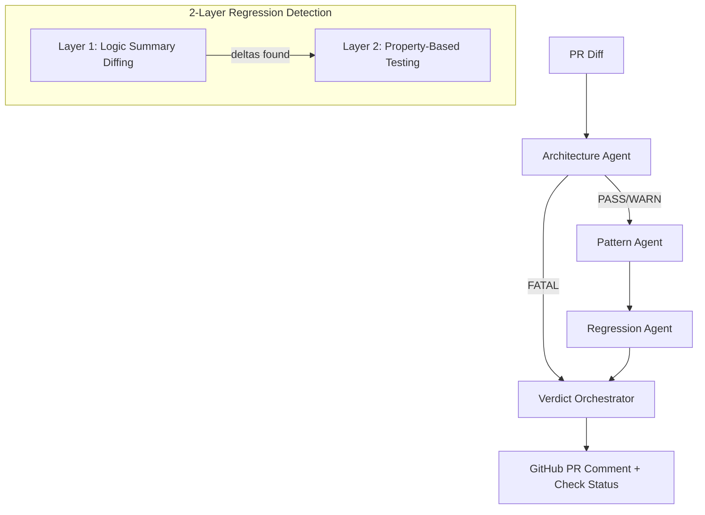

# AgentProbe

[](https://python.org)
[](https://www.langchain.com/langgraph)
[]()
[](https://opensource.org/licenses/MIT)

> Deterministic PR governance as a GitHub Action. Architectural boundaries + naming conventions + import rules checked against your codebase using AST parsing — no LLM judge, no hallucinated findings, no per-PR API cost.

## Why I Built This

Most AI code-review tools in 2026 ([CodeRabbit](https://www.coderabbit.ai/), [Qodo](https://www.qodo.ai/), [GitHub Copilot code review](https://docs.github.com/en/copilot/using-github-copilot/code-review)) are LLM-first. That's the right call for finding *bugs* — LLMs are genuinely good at that — but the wrong call for *governance*: "this module must not import from analytics," "every service must inherit BaseService," "no new `any` types in TypeScript." Those are deterministic rules, and running them through an LLM adds latency, API cost, and the risk that the model hallucinates a violation (or misses one) on any given PR.

AgentProbe fills the narrow gap: **deterministic AST-based policy enforcement** that runs alongside (not instead of) your LLM reviewer. Architecture and Pattern agents parse the diff, cross-check it against a YAML policy, and emit structured verdicts. Zero LLM calls. Zero API keys required. The Regression agent optionally runs a local Ollama model for semantic diff summaries, but it's not on the critical path.

## Technical Highlights

- **2-layer regression detection:** Logic Summary Diffing (Layer 1) → Property-Based Testing (Layer 2). Layer 3 (Behavioral Fingerprinting by subprocess execution) is disabled — executing unvetted PR code inside a governance runner is an RCE primitive and requires a proper sandbox (gVisor / Firecracker) that is out of scope here
- **Weighted scoring with short-circuit:** Architecture violations (40%) can auto-BLOCK before Pattern (25%) or Regression (35%) even run
- **AST-first, not LLM-first:** Architecture and Pattern agents use `ast.parse()` for deterministic analysis — no API keys, no rate limits, no hallucinated findings
- **90 pytest tests** covering agents, HMAC webhook verification, parsers, end-to-end workflows, and integration paths
- **LangGraph state-graph orchestration** with typed state passing, YAML-driven boundary rules, and conditional short-circuit routing

## Architecture



## Agents

| Agent | Purpose | LLM? |
|-------|---------|------|
| **Architecture Agent** | Checks module boundary violations and layer rules | No |
| **Pattern Agent** | Enforces naming conventions, import order, forbidden patterns | No |
| **Regression Agent** | Detects semantic behavior changes in modified functions | Optional (Ollama) |
| **Verdict Orchestrator** | Aggregates scores and generates PR comment | No |

## Scoring

Weighted formula: `Architecture(40%) + Pattern(25%) + Regression(35%)`

| Score | Verdict |
|-------|---------|
| 0-40 | PASS |
| 41-70 | WARN |
| 71+ | BLOCK |

Architecture `FATAL` triggers an automatic `BLOCK` via short-circuit (skips Pattern + Regression).

## Quick Start

### As a GitHub Action

```yaml
# .github/workflows/agentprobe.yml
name: AgentProbe
on:
  pull_request:
    types: [opened, synchronize]

jobs:
  governance:
    runs-on: ubuntu-latest
    steps:
      - uses: actions/checkout@v4
      - uses: rakshithmuda22/agentprobe@main
        with:
          github_token: ${{ secrets.GITHUB_TOKEN }}
```

### Local Development

```bash
# Clone and install
git clone https://github.com/rakshithmuda22/agentprobe.git
cd agentprobe
python3.11 -m venv .venv
source .venv/bin/activate
pip install -e ".[dev]"

# Run tests
pytest tests/ -v

# Optional: Start Ollama for LLM-powered regression analysis
ollama pull llama3
ollama serve
```

## Configuration

### `.agentprobe/config.yaml`

```yaml
thresholds:
  block: 70
  warn: 40
weights:
  architecture: 0.40
  pattern: 0.25
  regression: 0.35
regression:
  critical_dirs: ["src/payments", "src/auth"]
  max_llm_calls_per_pr: 20
  timing_divergence_threshold: 0.20
cache:
  backend: memory
llm:
  provider: ollama
  model: llama3
  base_url: http://localhost:11434
```

### `.agentprobe/boundaries.yaml`

```yaml
modules:
  payments:
    allowed_imports: [utils, models]
    forbidden_imports: [analytics, marketing]
  analytics:
    allowed_imports: [utils]
layers:
  - name: presentation
    modules: [src/api, src/web]
    can_import: [domain]
  - name: domain
    modules: [src/models, src/services]
    can_import: [infrastructure]
  - name: infrastructure
    modules: [src/db, src/cache]
    can_import: []
```

### `.agentprobe/style-profile.yaml`

```yaml
naming:
  functions: snake_case
  classes: PascalCase
  files: snake_case
imports:
  order: [builtin, external, internal, relative]
forbidden:
  - console.log-in-production-code
  - any-type-in-typescript
```

## Webhook Server

For self-hosted deployments:

```bash
export GITHUB_TOKEN=ghp_...
export GITHUB_WEBHOOK_SECRET=your-secret
uvicorn src.integrations.webhook_server:app --host 0.0.0.0 --port 8000
```

Configure your GitHub webhook to point to `https://your-server/webhook` with content type `application/json` and the same secret.

## Security

- Webhook signature verification (HMAC-SHA256) is **always required**
- Function names are validated against `[a-zA-Z_][a-zA-Z0-9_]*` before subprocess execution
- Source code size limits prevent DoS (50KB per function, 1MB per diff)
- Subprocess execution uses timeouts (10s fingerprinting, 30s property tests)
- Constant-time signature comparison prevents timing attacks
- No arbitrary code execution from PR diffs without validation

## Project Structure

```
agentprobe/
  src/
    agents/           # Architecture, Pattern, Regression, Verdict
    cache/            # In-memory cache with TTL
    config/           # YAML config loader
    graph/            # LangGraph DAG (state, workflow, nodes)
    integrations/     # GitHub App, webhook server, action runner
    parsers/          # Tree-sitter engine, diff parser, import graph
    profiles/         # Boundary loader, style generator
  tests/              # 90 governance tests: agents, parsers, workflow, integrations
  action/             # GitHub Action manifest and Dockerfile
  .agentprobe/        # Default configuration files
```

## License

MIT
